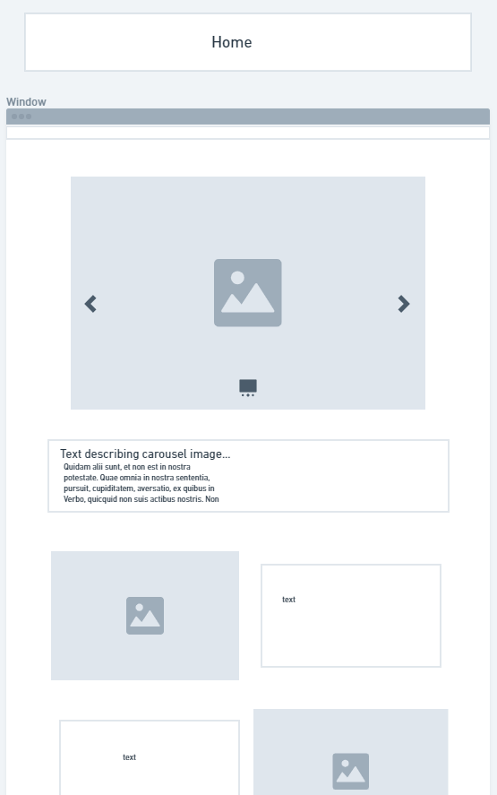
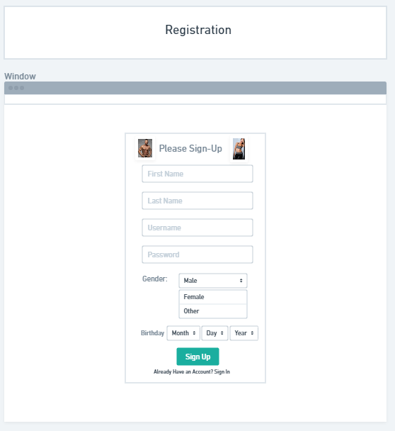
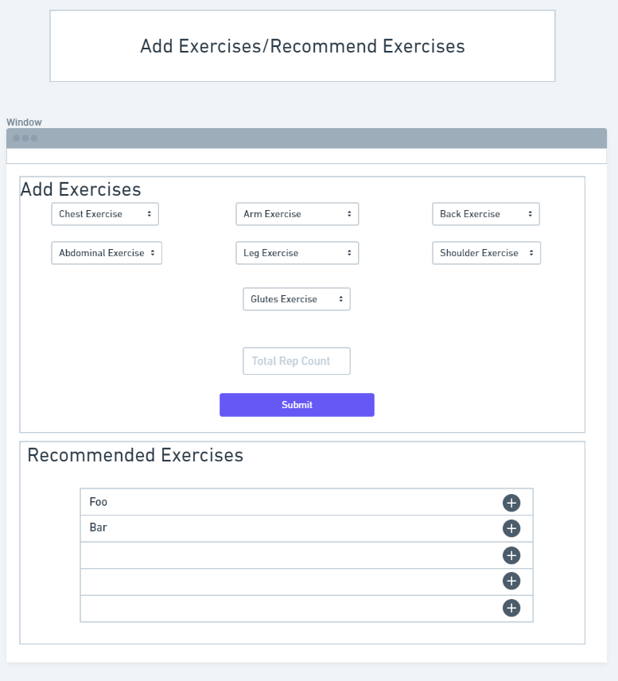
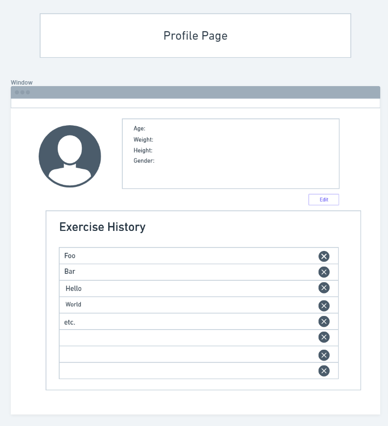
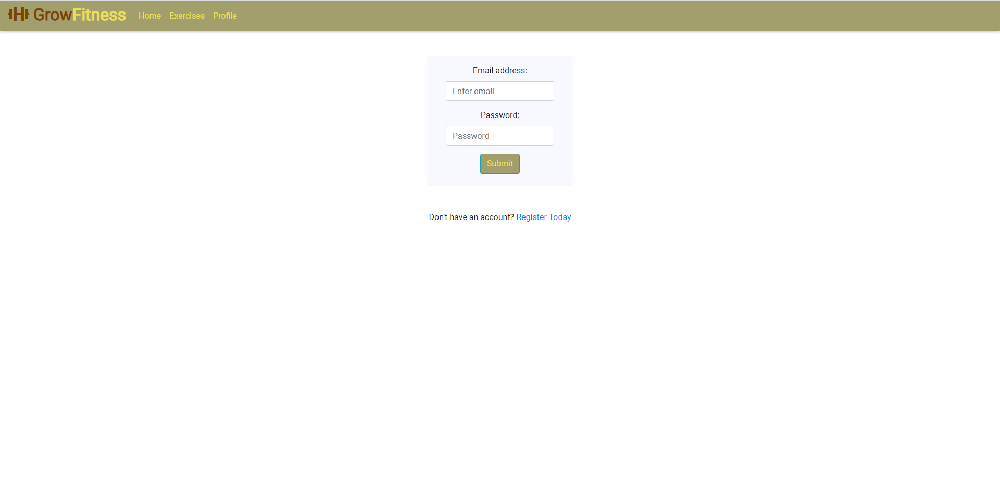
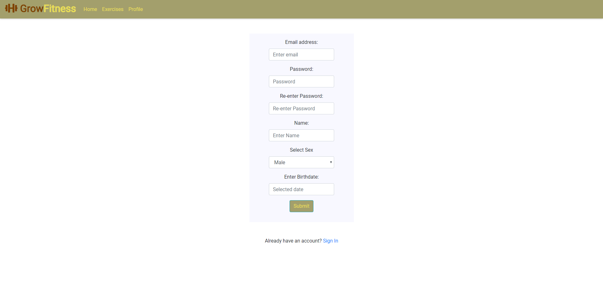
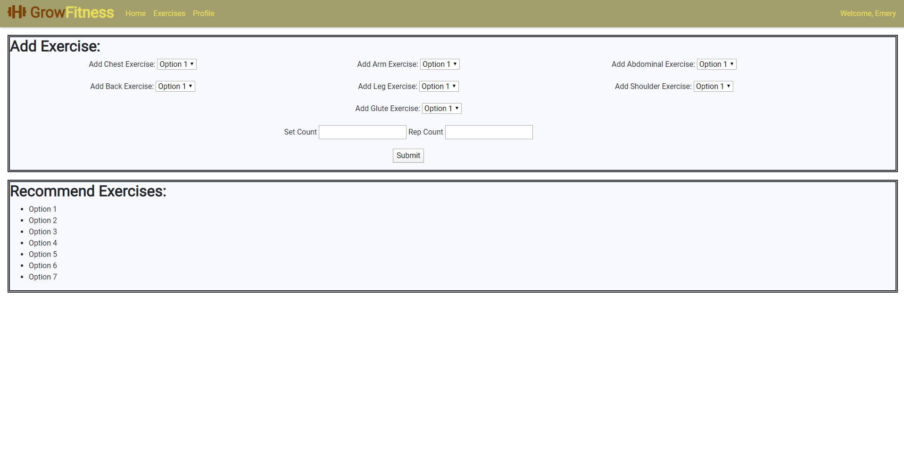

# Team Chi

# Grow Fitness

# Part 0: Data Interactions
Data being stored includes:
- personal information about each individual/profile
- data about the muscle groups for each profile (i.e. volume control)
- List of exercises done (i.e. what increments the counter)
Important Components
There are several distinct components that will be incorporated into the solution. The UI will be a basic interface with a div to enter info about the user, a basic stats sheet, and an area with recommended workouts for the user. The UI will incorporate Bootstrap to improve overall readability. This UI also allows users to interact with and edit their saved data in the HTML itself. Each user will have an individual profile, which means that each user will have a profile and the client must connect to a server (TypeScript-based) to retrieve relevant info. This design also supports the login/logout feature of the project and authenticates users, allowing them to access their own data.
Functionality and Data Representation to include:

Update/Delete Functions:
Update: Exercises Done, Adjusting weekly volume
Delete: Delete Accounts, Delete exercises, Refreshing weekly volume
Data Representation:
The add function is for a user, and the user profile is updated with new components of the workout
A high level description is each profile will be using a volume counter to track the amount of work each muscle group does per week
This innately will incorporate updating the exercise done by the individual, and allows for a CRUD methodology similar to how we have done the counter labs in class

# Part 1: Wireframes

The landing page for the website is a pre-login home page which the user can look over the web application and see the different description of the project. The website has a login/registration page to sign in/register to the account. From their the user is moved to the profile page that gives a summary of the user. Then they can add exercises and see what is recommended by moving to the add exercises page to add to the account.
# Part 2: Web Interface

Division of Labor:
Zach: Profile page [html], All pages [bootstrap/theme], making sure the UIs are not disjoined, Milestone 1 Write Up
Lucas: Home page [html], Home page [bootstrap]
Nick: Add_Exercises, Login, Registration Page [html], Write Up
